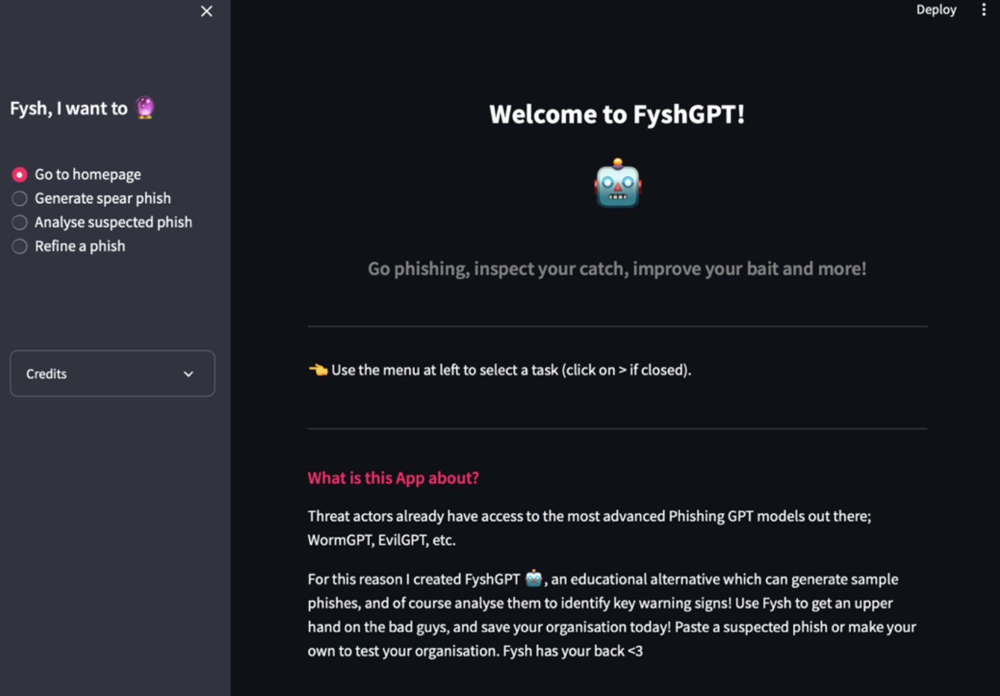
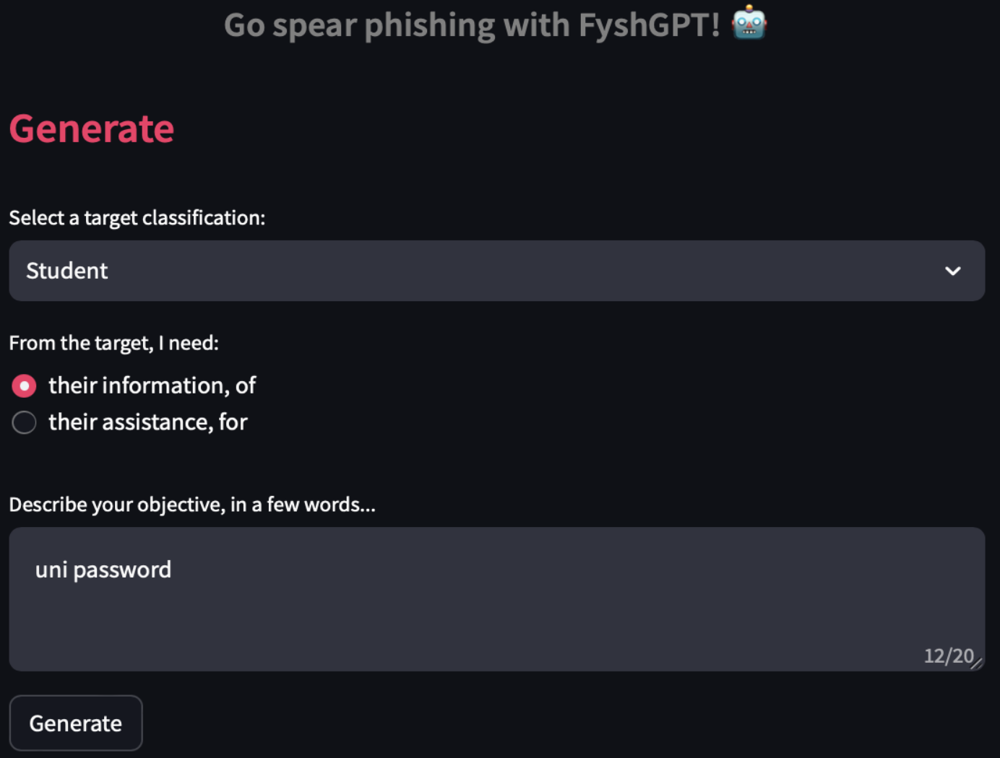
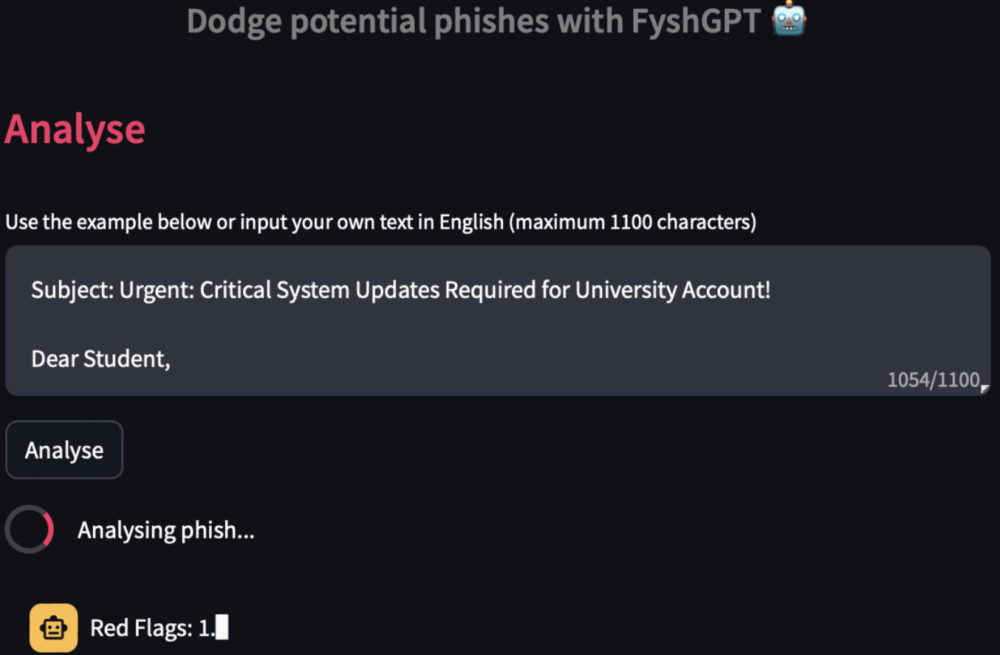
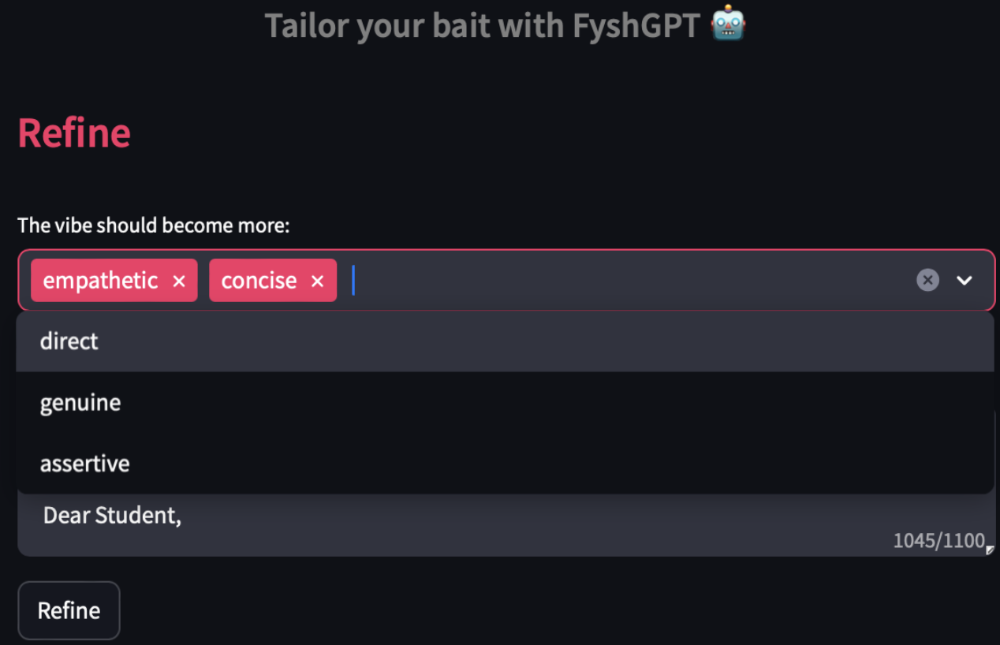

# FyshGPT
> A social engineer's one-stop-shop

FyshGPT is an educational spear-phishing webapp I made for my Extended Cybersecurity capstone in 2023; aiming to showcase the dangers of LLM's, and highlight the significant alignment work that remains to be done; even for closed-source foundation models like OpenAI's GPT-4.

## Main features:
1. The crafting of spear-phishes from scratch; tailor- made to a target’s context for maximum effectiveness.
2. Analysis of a suspected phish; identification of key red flags, and suggested steps to take in response.
3. Refinement of an existing phish; by improving tone or phrasing to increase its relevance + believability.

### 1 - Generation
> Enables creation of spear-phishes for any context with ease! *For educational purposes only :)

Usage:
* Range of target classifications for user to select from
* From there, just specify an objective and hit generate
* The response will start streaming back in real-time!

### 2 - Analysis (with screenshot input!)
> Wondering how easy it is to spot? Let Fysh analyse for you!

* Identifies + explains 3 key red flags present in the email
* Suggests 3 actionable steps to take in response!
* Analysis even accepts screenshot input (experimental)

### 3 - Refinement
> Here, users can tweak their phish to be even more effective!

* Allows for easy iteration of various length and tone options
* Can even select multiple at once to improve upon
* Can easily feed back into analysis for limitless improvement!

Want to connect? Find me at <a href="https://www.linkedin.com/in/z-saber">LinkedIn</a>

Thanks for checking this out! :)
